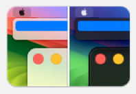

# Raycast macOS System Appearance Controller

This script command lets you set or toggle the macOS system appearance.

Read more about Raycast Script Commands [here](https://github.com/raycast/script-commands).

## Support

I wouldn't expect issues supporting a wide range of Mac hardware and macOS versions, however this has only been tested on M1 MBPs.
